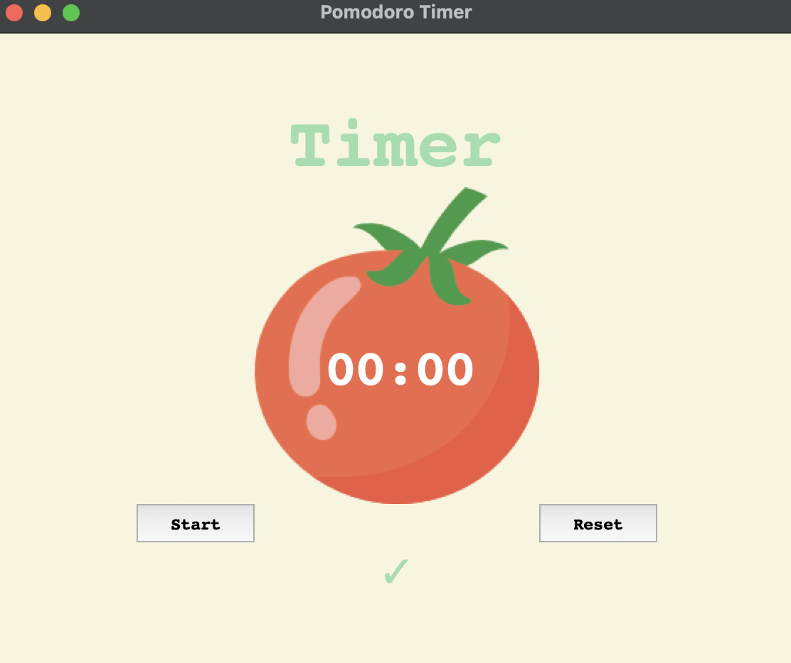

# 28 Pomodoro Timer - Changelog

## v0.1

- Created main Tkinter window: Initialized a `Tk` instance, set the title to "Pomodoro Timer", and configured background color and padding for layout spacing.
- Implemented Canvas widget: Used `Canvas` to layer elements, enabling placement of an image and text together in one area of the UI.
- Loaded and displayed image: Used Tkinter’s `PhotoImage` to load `tomato.png` and displayed it at the canvas center with `create_image()`.
- Added countdown text overlay: Placed "00:00" text over the tomato image using `create_text()` and customized font, color, and positioning.
- Removed canvas border: Set `highlightthickness=0` to remove the default white border for a seamless background blend.

---

## v0.1.1

- Added timer title label: Placed a "Timer" label above the canvas with custom font, size, and colors.
- Added Start and Reset buttons: Created styled buttons with padding and font adjustments (no functionality yet).
- Added completion checkmark: Displayed a green checkmark below the canvas to indicate completed sessions.
- Applied grid layout: Used `.grid()` for positioning widgets in a structured row/column format.

---

[//]: # (## v0.2)
