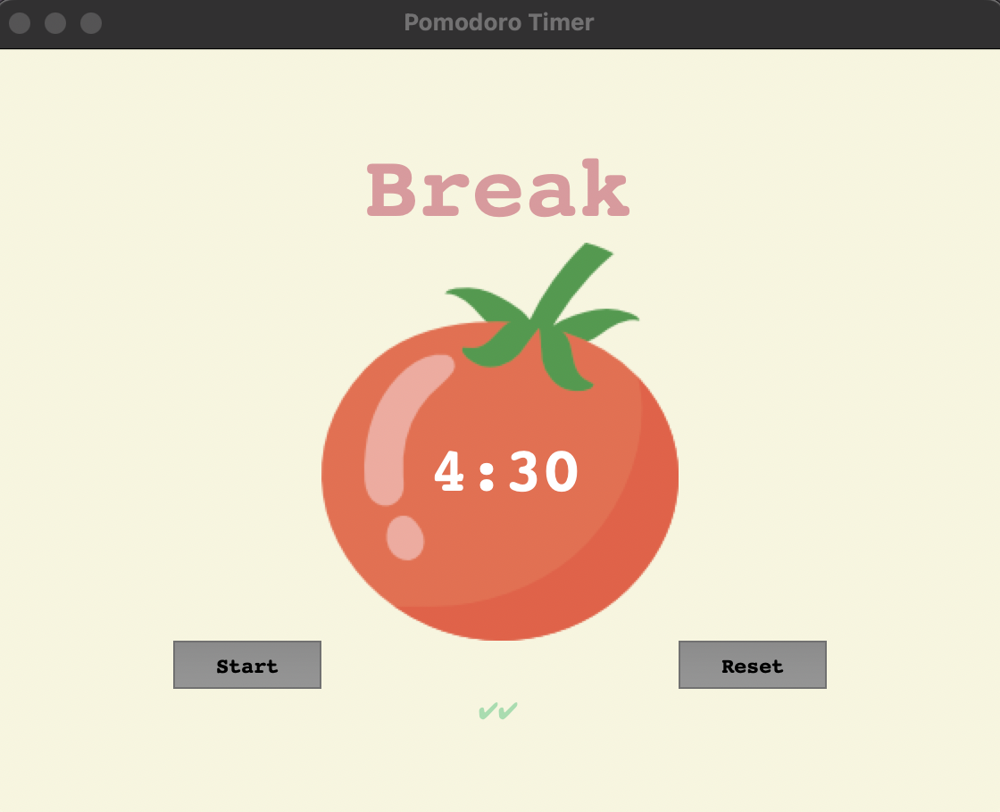

# 28 Pomodoro Timer - Changelog

## v0.4.0

- Implemented Reset button functionality: The Reset button cancels any ongoing timer using `window.after_cancel(timer)`, resets the display to "00:00", restores the title label to "Timer", and clears all checkmarks.
- Added session reset logic: Reinitialized the `reps` counter to `0` to restart the Pomodoro cycle from the beginning after a reset.
- Introduced dynamic session checkmarks: After each completed work session, a checkmark (`✔︎`) is appended to a label to visually indicate progress.
- Automated session transitions: Configured the app to automatically switch between work and break sessions using conditional logic and `window.after` scheduling.
- Finalized UI setup: Ensured all interface elements (buttons, labels, canvas) are properly aligned using the grid layout for a polished final layout.
- Restructure changelog to be in descending order with latest version first to earliest version.

---

## v0.3.0

- Added work/break session logic: Introduced a session counter to alternate between work sessions, short breaks, and long breaks.
- Implemented session switching: Used `if` conditions with modulo arithmetic (`reps % 8 == 0`) to determine long breaks every 8th rep, short breaks otherwise.
- Updated title label dynamically: Changed label text and color to reflect whether it’s “Work,” “Short Break,” or “Long Break.”
- Automated session flow: Configured `start_timer()` to restart the next session automatically when countdown reaches zero.

---

## v0.2.1

- Improved time formatting: Ensured countdown always shows `MM:SS` format by padding single-digit seconds with a leading zero.
- Refined `countdown()` display logic: Replaced raw seconds with formatted output for better readability.

---

## v0.2.0

- Implemented countdown mechanism: Added `countdown()` function using `window.after` to update the timer every second.
    

    
    

- Converted seconds to minutes/seconds: Used `math.floor` and modulus to calculate minutes and remaining seconds.
- Added formatted time display: Ensured seconds always display two digits (e.g., `05` instead of `5`).
- Linked Start button to timer: Configured `command=start_timer` to trigger countdown when pressed.
- Stored timer text as variable: Allowed dynamic updates to the Canvas text instead of a static display.

---

## v0.1.1

- Added timer title label: Placed a "Timer" label above the canvas with custom font, size, and colors.
- Added Start and Reset buttons: Created styled buttons with padding and font adjustments (no functionality yet).
- Added completion checkmark: Displayed a green checkmark below the canvas to indicate completed sessions.
- Applied grid layout: Used `.grid()` for positioning widgets in a structured row/column format.

---

## v0.1.0

- Created main Tkinter window: Initialized a `Tk` instance, set the title to "Pomodoro Timer", and configured background color and padding for layout spacing.
- Implemented Canvas widget: Used `Canvas` to layer elements, enabling placement of an image and text together in one area of the UI.
- Loaded and displayed image: Used Tkinter’s `PhotoImage` to load `tomato.png` and displayed it at the canvas center with `create_image()`.
- Added countdown text overlay: Placed "00:00" text over the tomato image using `create_text()` and customized font, color, and positioning.
- Removed canvas border: Set `highlightthickness=0` to remove the default white border for a seamless background blend.

---
<section align="center">
  <code>coderBri © 2025</code>
</section>
