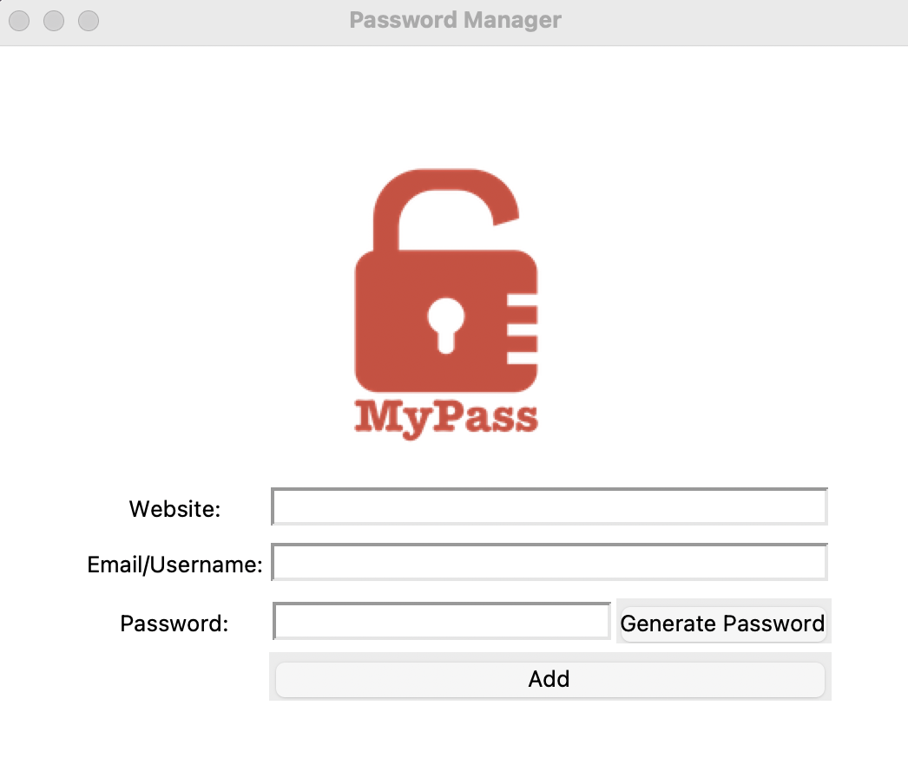

# 29 Tkinter Password Manager - Changelog

## v0.2.0

- Completed the user interface layout using `grid()` instead of `pack()`.
- Implemented a three-column, five-row grid structure for widget alignment.
- Added labels and input fields for **Website**, **Email/Username**, and **Password**.
- Introduced **Generate Password** and **Add** buttons with appropriate positioning.
- Centered the logo at the top using column alignment and improved window spacing for a cleaner layout.

---

## v0.1.0

- Created the main application window titled **"Password Manager"**.
- Configured window padding and background color.
- Added a `Canvas` widget with dimensions **200x200px** to display the app logo.
- Loaded and centered the `logo.png` image inside the canvas.
- Finalized basic UI setup as the initial foundation for the project.

---
<section align="center">
  <code>coderBri © 2025</code>
</section>