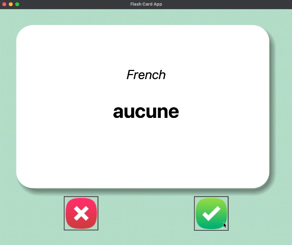
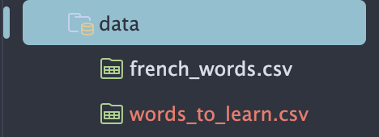

# Flash Card App - Capstone Project

<div align="center">

</div>

## 31.4 • Saving Your Progress
**Release Date:** July 17, 2026

- **Implemented Persistent Progress:** Added logic to track user learning by removing "known" words from the active list and saving the remainder to `data/words_to_learn.csv`.
  
  <div align="center">
  
  </div>

- **Added Error Handling:** Integrated `try-except-else` blocks to check for existing progress files on startup. The app now intelligently defaults to the original `french_words.csv` only if a progress file is missing.
- **Optimized Data Export:** Configured `to_csv(index=False)` when saving the remaining deck. This prevents the duplication of index columns, ensuring the CSV format remains clean and consistent for future re-importing.
- **Refined Interaction Flow:** Updated the "Known" button command to trigger `is_known()`, effectively updating the database before seamlessly transitioning to the next card.

---

## 31.3 • Implementing Card Flip Logic
**Release Date:** July 17, 2026

- **Implemented Auto-Flip Timer:** Integrated `window.after(3000, ...)` to automatically trigger the `flip_card()` function after a 3-second delay, revealing the English translation.
- **Added Timer Reset Logic:** Incorporated `window.after_cancel(flip_timer)` within the `next_card()` function. This ensures the countdown resets every time the user manually selects a new card, preventing overlapping timers.
- **UI State Management:** Updated `flip_card()` to modify canvas text colors (from black to white) and swap the background image to `card_back.png` for a distinct "flipped" visual effect.

---

## 31.2 • Data Integration & Creating a New Card Logic
**Release Date:** July 17, 2026

- **Implemented Pandas Data Extraction:** Integrated `pandas` to read the `french_words.csv` file. 
- **Optimized Data Formatting:** Converted raw CSV data into a list of dictionaries using `data.to_dict(orient="records")`. This approach improves data accessibility compared to the default `to_dict()` behavior:
    - **Default (Nested):** Creates a column-centric structure: 
      ```py
      {'French': {0: 'partie', 1: 'histoire'}, 'English': {0: 'part', 1: 'history'}}
      ```
      This requires complex indexing to access specific word pairs.
      
    - **`orient="records"` (Flat):** Creates an iterable list of row-centric dictionaries:
      ```py
      [{'French': 'partie', 'English': 'part'}, {'French': 'histoire', 'English': 'history'}]`. 
      ```
      This allows for direct key-based access (e.g., `current_card["French"]`).
      
- **Added `next_card()` Functionality:** Created core logic to randomly select a dictionary entry from the vocabulary list using `random.choice()`.
- **Dynamic UI Updates:** Configured the `next_card()` function to update the canvas text elements (`language_title` and `vocab_word`) with the selected French vocabulary.
- **Event Binding:** Linked both the "Known" and "Unknown" buttons to the `next_card()` function to trigger a fresh word selection upon every click.

---

## 31.1 • Setup: Creating the UI
**Release Date:** July 17, 2026

- Created the main Tkinter application window.
- Configured window padding and background color.
- Added image assets for the flash card and response buttons.
- Created the flash card canvas and displayed the front card image.
- Added placeholder text for the language and vocabulary word.
- Created "Known" and "Unknown" response buttons with image icons.
- Added a CSV file containing French words and their English translations.
- Organized the initial user interface using Tkinter's grid layout.

---
<section align="center">
  <code>coderBri © 2026</code>
</section>